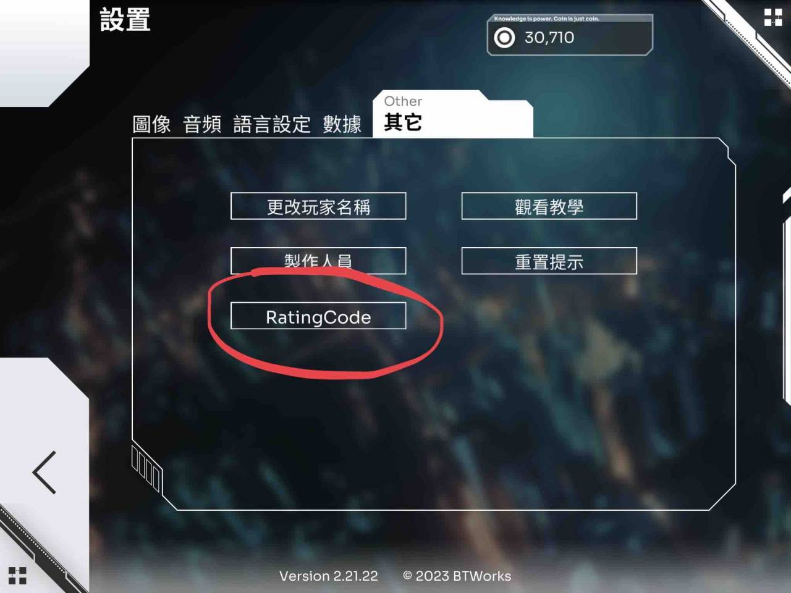
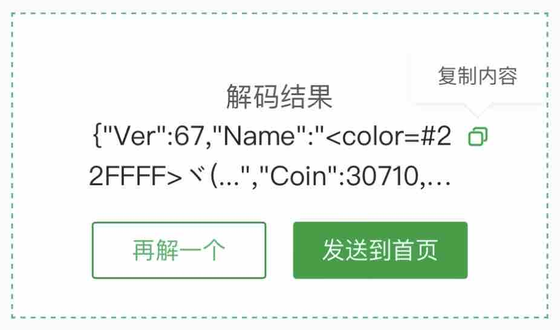

# 雪绘bot使用指南

(by 黑糖＆户山兔兔)

本指南最后更新于2023年10月22日

## 关于Bot

本bot是由户山兔兔基于频道/群聊开发的Orzmic查分机器人，b20图片部分由兔兔编写

## 用前须知

1. **在使用雪绘bot前，请您确认已经阅读了频道规定。**
2. 为防止大量刷屏，查分区中设置了慢速模式，请不要在查分区里发无关查分的内容。
3. 遇到报错或需要反馈时，请联系管理员或移步反馈区，建议在反馈之前先详细阅读反馈区置顶帖子。
4. 请尽量用手机发送指令！电脑发送有小概率会导致未知问题！如果出现错误的话请尝试使用手机重发。
5. 请不要玩弄雪绘!多次篡改b20数据生成整活图片浪费服务器资源的，视情节轻重禁言处理。

## 使用步骤

1. 打开Orzmic，在设置-其他里找到Ratingcode一栏，打开并截图。

2. 将获得的二维码转换成一串文本，这里提供一个网址：[二维码解码器](https://cli.im/deqr )
，你也可以使用软件"一个木函"、"<a href="weixin://">微信</a>"等APP的自带解码器,（注：不要用qq自带的解码功能，极大概率会出错）

(现在orzmic已经自带解码)



3.输入/b30 \[文本内容] 来召唤机器人查询（部分环境下可能需要at机器人，文本内容不需要带上括号，直接粘贴就可以了）


## 其他功能

### /查曲 xxx（仅群聊版）

模糊查询歌名。使用 “/查曲 xxx”获取编号

使用/songinfo 编号获取详细信息

### /info 账号个人信息查看

使用/info即可（需要有历史查询记录，频道需要at）

1. 到查分区@雪绘Bot，并输入指令，格式为：`@雪绘Bot /b20 解码内容`[^（1）]
2. 等待片刻，找到你的查分图。[^（2）]

### history指令

```
/hist 
/hist -f
/hist -r b20 -n[历史记录编号]
/hist [历史记录编号]
```

第一、二条指令用于获取你的历史查分图，第三，四条让你可以查询你的历史查分图

历史记录编号就是-f指令显示的编号


[^（1）]: 在输入指令时，请注意以下几点：1.要at雪绘！要at雪绘！要at雪绘！重要的事情说三遍！（群聊可以不at，但是频道必须at    ）2.解码内容不要出错啦！4.请确认解码内容与/b20之间有一个空格！（一般来说系统会给你补上的）

[^（2）]: 当你的查分图上某一首歌出现了警告图标，没有关系，可能是因为版本更新的物量变化导致分数大于理论最高分，请不要因为这种事情麻烦管理啦～当然如果你要反馈的话还是可以到反馈区提出意见哦～