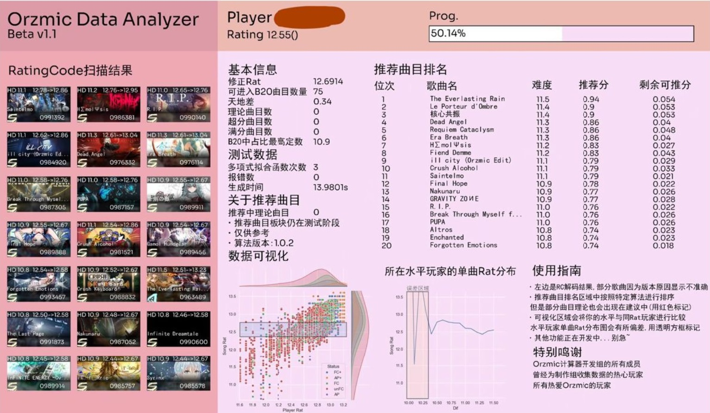

# 推分小助手自定义指南

(by 黑糖＆乾狐离光)

指南于2023年10月22日更新

* * *

## 摘要

在第一次小版本更新后，我们提供了自定义模块给玩家更好的推分建议。玩家通过额外输入参数，可以自定义算法的某些数值，以达到个性化推分的目的。

* * *

## Suggest功能自定义

### 指令

```
/suggest -t [int1(拟合次数)] -x [float1(拟合时的圆滑程度)] -f [str] -n [int2] {b20}
```

例如

```
/suggest -t 4 -x 0.002 -f "True" -n 120 {"Ver":67,"Name":"这是一个示例","Coin":30710,"CharID":13,"CharSkinID":0,"CharUnlock":"TTTTTTTTTTTTTTFTTTTT","Rat":"13.01","SPRat":"6","Prog":"97.32%","SPScores":["9,3,980200,4","53,3,978854,4","60,3,975880,4","75,3,983539,4","101,3,984554,4"],"B20Scores":["123,2,1000000,2","138,2,995787,4","95,2,997915,4","59,2,999469,3","74,2,997200,3","122,2,996752,3","137,2,1000000,2","73,2,997525,3","9,2,1000000,2","84,2,1001130,0","20,2,1000468,1","101,2,1001043,0","114,2,999120,3","100,2,997130,4","91,2,1000799,0","135,2,1000821,0","48,2,999452,3","40,2,998846,3","113,2,1000000,2","121,2,1000000,2","63,2,999081,4","104,2,998240,3","105,2,1000952,0","35,2,1000000,2","142,2,1000000,2"]}
```

### 参数说明

- -t 多项式次数

次数越大，曲线越接近于玩家数据，但是当数据不足时会导致数据误差极大，同时会导致过拟合[^（1）]。说的通俗易懂一点就是你的预期和实际结果相差甚远。当然，玩家Rat>12.5的人可以尝试提高次数，得到最适合自己的推分建议，特别不建议Rat很低的人使用。

- -x 拟合时的圆滑程度

该值越大，得到的曲线就越平滑，系统对于定数之间差距的识别就越小。-x改变玩家推荐曲目的效果远比-t要大。所以，如果觉得推分建议过于保守可以适当调大该值，系统会给你推更高定数的歌曲。至于为什么越圆滑对于定数之间差距的识别就越小，我相信你也不需要了解，对吧？

- -f 快速模式

适用于高压环境，当多人同时查询时为了减小雪绘的负担，你可以通过停用一些功能来保护雪绘，防止雪绘崩溃(目前只停用可视化图形的部分显示)

- -n 采样精度

此数值越大，采样精确程度就越高，得到的数据就越精确。但是，调大该数值会很大影响到雪绘的生成时间;减小该数值对于雪绘的生成时间的降低不明显，只要不低于10一般不会对结果产生较大影响。

### 参考值

- -t 默认值3，建议3-4，不要填小数否则可能会报错

- -x 默认值0.001，建议0.0001-0.003，再高你可以试试，但大概率没有用

- -f 默认值无，可选"True"，正常环境下建议不使用

- -n 默认值100，建议 10-200，日常无人查分时可以适当增加精度

### 注意事项

1. 低rat玩家(12.2左右)若对自己的推分建议感到不满意，或者发现雪绘推了自己不会的歌，可以适当减小x的值(但是一般会出现nan[^（2）]的情况，下面有讲)

2. 如减小x时遇到推分值=nan的情况，请增大x，此时看到的推分建议看似行实际上是错误的! (虽然我也不知道为什么错误的数据看起来很符合实际情况)另外，如果高rat玩家(约13.19)遇到nan情况是非常正常的。

另：2023/10/6更新:大大减小了出现nan的概率

### 调整目标

伴随你推分的进程。以后不断按照自己的情况修改参数，也能得到很好的推分建议。

### 补充

关于-x的问题，我也思考了很久。最初设置-x的目的是为了给玩家更适合的推分建议，但是时间久了以后我发现-X在不同的rat区间和不同的人身上是很不一样的，这给玩家造成了一定量的麻烦，违背了从简操作的初衷。

所以在这里给所有使用推分小助手而造成非良好体验的玩家道个歉。

由于我的学业进入了一个比较紧张的阶段，在国庆以后可能没时间改代码，请低rat玩家和所有推分建议异常的玩家研究一下这个帖子，我会尽快地把-x适应代码和历史记录模块的代码做出来，希望以后能够做到只输入一次-x，不管何时推分的建议都是精准的。

愿推分小助手能够陪伴你在游玩Orzmic时的时光。

**在代码写出来之前，我会在下面补充一些rat对应的-x信息，持续更新，请及时查看**

```
rat约13 x=0.0015
rat约12.8 x=0.001
rat约12.55 x=0.0007~0.001
```

*如果输入了不合适的x，可能造成以下结果*



***这是某玩家的RC解码结果以及建议***

我们发现其推分建议有明显误差

此时指令应改为

`@雪绘Bot /suggest -x 0.0007 {其b20}`

x的数值应减小以区别定数之间的差距

欢迎玩家来向我(黑糖)提供合适的-x取值，这对后续的开发很有帮助，谢谢!

## Score指令

版本 0.1.0

状态:已上线

上线时间 2023/10/17

最新更新 2023/10/22

### 指令

```
/score -t [目标rat] -j [easy|hard] -e [目标error数] -d [目标disrupted数] -l [歌曲定数] -n [歌曲物量] -m [history|normal] -r [歌曲RC码] -s [歌曲]
```

### 参数说明

- -t target 目标Rating
- -j judge 判定
- -l level 定数
- -n note 物量
- -m mode 模式
- -r RatingCode RC码
- -s song 歌曲

当输入-s时，即输入歌曲，-m/-r/-l/-n参数不填 (填了也无效)，此时只要输入目标rat即可返回达到目标rat需推的分

当输入-r时，即输入rc码，-m/-s/-l/-n参数不填，其他的和上面方法得到的结果相同

当输入-m时，因history弃用，故只有normal模式，此时-s.-r参数不填，这个模式下获取不到歌曲信息故而请填入歌曲物量，歌曲定数以及目标rat(-n -l -t)

-j 为可选参数，默认easy (宽判) ，当-j为严判时显示当严判推分时满足的最大d/e数 (当有-d/-e参数时显示的会有不同，下面会讲)，当为宽判时同理

-d和-e 为可选参数，默认不填入，当-d或-e输入时，以输入-d为例，则显示满足该d数时最多可爆多少e数，无论你输不输入，都会提示一个容错，它代表你的目标分数和当前判定最高分所差分数和1个note的分数的商

若d/e参数均填入，则显示可不可以在该情况下推到指定目标rat

请注意：目前仅支持Hard难度谱面查询，以上参数的顺序不是重要的

#### 编者注

黑糖写的有点不好懂，如果看不懂的话，没事，这边有狐狸为你提供的省流版(参数顺序不是重要的，只不过这个顺序容易记)：

1. 使用歌曲名查询

```
/score -t [目标rat] -s [歌曲名]
```

目前直接输入歌曲名有概率输出错误曲目(除非你完整的写全了名字，尽管如此也会有概率爆掉)，请注意

2. 使用RC码查询

```
/score -t [目标rat] -r [目标歌曲的RC码]
```

这是比较复杂但绝对不会错的方法，如何获取一首歌的RC见下图(抱歉目前暂未加入RC查询指令)


3. (不推荐)自定义难度与物量

```
/score -t [目标rat] -m [模式，目前似乎并没有什么用但是大概是必填的] -l [歌曲的定数] -n [歌曲的物量]
```

如果乱填会出bug！不要乱填，不要乱填，不要乱填！

4. 自定义判定难度

在参数中加入`-j easy`或`-j hard`即可指定目标的判定难度

他们分别代表宽判和严判

5. 查询指定E/D所需D/E，或对应E/D是否能达到目标

参数`-e`与`-d`分别代表error和disrupted

- 仅输入E/D：输出在已有该数量E/D情况下至多能容许多少D/E

例如：我已经有10个E，再多至少5个D就会导致无法到达目标，输入`-e 10`，则输出`已有10个E，至多再有4个D`

- E和D都输入

例如：我输入`-e 10 -d 5`，输出`10个E和5个D不能满足推分要求`

## history指令

版本 0.0.1

状态:已上线

上线时间2023/10/21

### 指令

```
/history -f
/history -r b20 -n[历史记录编号]
```

第一条指令用于获取你的历史查分图，第二条让你可以查询你的历史查分图

历史记录编号就是-f指令显示的编号

[^（1）]: 过拟合，指的是模型在训练集上表现的很好，但是在交叉验证集合测试集上表现一般，也就是说模型对未知样本的预测表现一般，泛化能力较差
[^（2）]: Not a Number，一般出现在程序数据无效的情况下