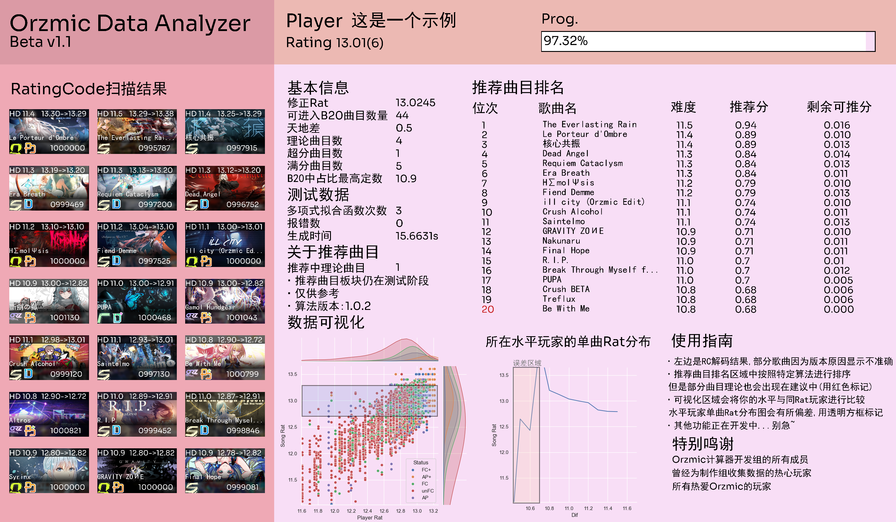

# 推分小助手使用指南

(by 黑糖)

指南于2023年10月22日更新

推分小助手当前版本: pre-v1.2

## 特别感谢

- [@思昔](https://space.bilibili.com/518645556) 提供的orz歌曲基本信息以及RatingCode基本转换思路
- [@Daniel_兔兔](https://space.bilibili.com/1333478733) 提供的qq消息截取方法以及服务器支持
- [@zhaomaoniu](https://space.bilibili.com/398218060)提供的接入api的代码以及代码优化思路
- 32位初期提供RatingCode的玩家和其他使用bot查询的玩家

## 用前须知

1. 本Orzmic数据分析器与东城eastown的任何音游计算器均无关，系个人编写
2. 软件具有时效性，当Orzmic版本更新时请等待编写者上传最新的数据
3. 对数据分析器的建议可私信编写者
4. 编写者为高中生，更新可能不勤快，别急~

## 授权信息

[@思昔](https://space.bilibili.com/518645556) orzmic计算器的部分信息(已授权)

## 更新内容

- pre2-v1.2

更新了score功能

- pre-v1.2

添加了history功能

- v1.1.3

添加了第1个插件/score，可以查看把歌曲推到B20里需要多少分

- v1.1.2

优化了算法

- v1.1.1

1. 更新了算法
2. 添加了自定义模块，详情请查看[自定义指南](./suggestdiy.md)
3. 修复了一些常见问题:GH HD物量错误/推分分值显示nan
4. 优化了代码，让查分变得更加快捷（提升约40%）

- v1.1

1. 重构了UI，更加简洁
2. 增加了B20查询模块，现可显示分数，定数，歌曲名称，曲绘，以及经过与同水平(玩家rat)玩家打同定数的歌的对比，得到新单曲rat
3. 增加了推分排名，可查看最适合你的推分歌曲
4. 增加了可视化图，更加清晰明了地看到你所处于什么水平

## 查询指令

建议推歌的查询指令为:`@雪绘bot /suggest 解码内容`

请按照/b20使用的前几步获取您的RatingCode解码内容

### 板块说明

#### B20区(就是最左边深红色的区域)

你的B20结果，一共显示前21位，请仔细甄别

图片的左下角分别是评级，全连/AP等状态和名字，右下角是分数，左上角是定数，右上角是单曲rat和修改后的单曲rat

注意：修改后的单曲rat仅供参考，实际情况请按实际单曲rat为准

#### 基本信息区

这里只解释修正rat，修正rat不是`所有修改后单曲rat总和/B20曲目数`，而是一套独立的原创算法，具体算法暂不公开，但是该rat也仅供参考，不加入推分歌曲的计算

另外修正rat一定大于等于玩家rat，既可以当作你的实际水平，也可以当作你推分的目标。当然了，对于rat>13的玩家，一般来说修正rat=玩家rat，如果修正rat>玩家rat只能说明你天地差太大了。

#### 测试信息区

这些都不用玩家去了解，仅作为测试员测试用

#### 推荐曲目信息区

有理论曲目在推荐一栏里是因为...我也不知道为什么，但是不影响对吧()

我已经把推荐里已经理论的曲子数目标在了这一栏里，注意识别。

#### 推荐曲目区

注意标红的序号表明对应歌曲已经理论，请忽略，推分分值越高，越建议玩家去推

当然，有些困难的歌也会得到很高的排名是因为很多玩家打了这首歌，使歌曲的出现频率分变高，导致最终排名的上升

如果看到了负分或者"-10000"，都是正常的，说明你已经快达到理论rat了。

#### 可视化区

第一张图所有散点表示库中所有玩家的b20成绩，透明方框是你的B20范围

注意第二张图中有误差区域，代表这一区域没有参考价值，样本数少，右边的区域是有参考价值的，可以对应你的b20看看哪些歌打低，哪些歌打得还不错。

### 注意事项

1. B20查询中的新单曲rat仅供参考，有一定误差，原因如下：

- 使用了拟合函数
- 同定数歌曲的难度相差也较大，比如核心共振和lpd的定数均为11.4，但是玩家普遍打lpd更高，这会导致核心共振就算打得很差，新单曲rat也有可能提高，同样lpd打得很好，单曲rat也有可能降低，所以在内部算法时我们不用这个数据作为参考标准。

2. 对于B20未满的玩家有80-90%的概率无法查询到推分建议，经过排查大概率是BUG，但是作者作为高中生没有太多时间去修BUG，所以你可以等到BUG修复完成，或者填满自己的B20

3. 对于rat<12的玩家，虽然提供推分建议，但是误差较大，原因如下：

- 我们未收集到很多低于12玩家rat的样本，导致无法精确计算哪些歌值得推分；
- 同样地，使用了拟合函数，造成误差。

4. 版本更新时会有很多问题，如下：

- 曲绘显示不出来
- 程序报错
- 定数错误
- 推分建议误差大

此时你可以@开发者，或者等待数据库更新完毕。(但是催别催过度了)

5.算法正在改进，我们无法确保所有玩家对于程序给自己的建议表示满意，但我们会尽量修改算法，让建议变得更加有用，精确。

6.推分小助手基于Python生成，生成速度真的非常慢，一般30s一张图，请耐心等待。

7.推分建议中剩余推分一栏中可能会出现错误，原因如下：

- BUG，无法区分EZ，NM，HD，SP难度，但最终以HD难度计算；
- 该歌曲推的人太多了（一般会在版本更新时），导致系统识别到该歌曲有推分潜力，就算无法推分也计到排行上，显示为"0.0"。

## 总结
在内测以后所有代码都重构了一遍，接入了bot。虽然bug有点多，但是以后会慢慢修复。再次感谢所有玩家的支持！